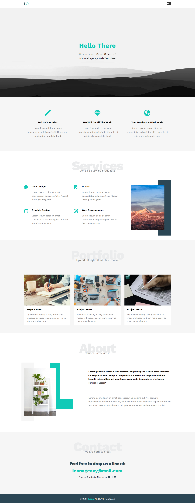

# Elzero Web School - HTML|CSS Template One

This is a template built with HTML and CSS

## Overview

After learning 37 videos of HTML and 88 videos of CSS
building practical projects is the best thing that i should do
so starting with Leon Agency

### Screenshot



### Links

Live Site URL: [https://al-ateek.github.io/HTML-and-CSS-Template-One/]
Template URL: [https://www.graphberry.com/item/leon-psd-agency-template]

### built with

- Normal HTML elements
- CSS custom properties
- Flexbox
- CSS Grid

### What I learned

Add media queries for building a responsive design

```css
.container {
    margin-left: auto;
    margin-right: auto;
    padding-left: 15px;
    padding-right: 15px;
}

/* Small Screens */

@media (min-width: 768px) {
    .container {
        width: 750px;
    }
}

/* Medium Screens */

@media (min-width: 992px) {
    .container {
        width: 970px;
    }
}

/* Large Screens */

@media (min-width: 1200px) {
    .container {
        width: 1170px;
    }
}
```

### Useful resources

- [Elzero Web School] - (https://elzero.org/) - This helped me to do everything in this project, I learn from it HTML, CSS and i will learn js from it too
